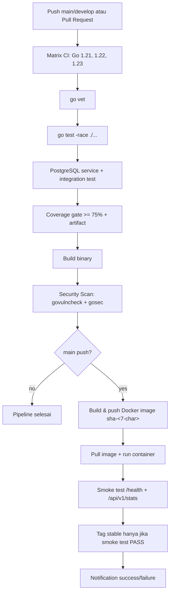

# Laporan PBL CI/CD - TaskFlow Go API

## 1. Identitas Kelompok dan Tool

- Kelompok: 2
- Fokus khusus: Matrix testing
- Tool CI/CD: GitHub Actions
- Registry container: GitHub Container Registry (GHCR)
- Source awal: https://github.com/fuaddary/operasional-pengembang/tree/main/pertemuan-09-cicd
- Baseline upstream yang diperiksa: commit `28de02b` (`week 9`)
- Repository kerja: `taskflow-cicd-devops-testing`

## 2. Ringkasan Implementasi

Implementasi dibuat untuk mencerminkan skenario S1 sampai S6 pada rubrik:

| Skenario | Status | Bukti utama |
|---|---:|---|
| S1 - bug fix, test, coverage | Selesai | 3 bug diperbaiki, test tambahan, coverage total 77.9% |
| S2 - CI otomatis | Selesai | Workflow trigger push/PR, matrix Go 1.21/1.22/1.23, vet, race, integration, coverage gate 75%, artifact |
| S3 - CD image registry | Selesai | Docker multi-stage `scratch`, push image tag `sha-<7-char>` ke GHCR |
| S4 - smoke test dan notifikasi | Selesai | Smoke test `/health` dan `/api/v1/stats`; Telegram notification via GitHub Secrets |
| S5 - rollback | Selesai | Tag `stable` kondisional dan target `make rollback ROLLBACK_TAG=...` |
| S6 - security audit | Selesai | SCA `govulncheck` dan SAST `gosec`, artifact JSON, gate memblokir pipeline |

## 3. Diagram Alur Pipeline



## 4. Tabel 3 Bug dan Test Pendeteksi

| Bug | File | Kode salah di baseline | Kode benar sekarang | Test pendeteksi |
|---|---|---|---|---|
| Integer division pada completion rate | `internal/service/service.go:172` | `float64(completed/len(tasks)) * 100` | `float64(completed) / float64(len(tasks)) * 100` | `TestCalculateCompletionRate`, `TestGetStats_CompletionRate`, `TestStats_ConsistencyWithTaskList` |
| Filter status terbalik di memory repository | `internal/repository/memory.go:58` | `if t.Status != status` | `if t.Status == status` | `TestFindByStatus_HanyaTodo`, `TestFindByStatus_HanyaDone`, `TestListTasks_WithStatusFilter` |
| Filter status terbalik di PostgreSQL repository | `internal/repository/postgres.go:122` | `WHERE status != $1` | `WHERE status = $1` | `TestPostgres_FindByStatus_HanyaTodo`, `TestPostgresRepository_WithFakePool` |
| Priority `urgent` tidak boleh valid | `internal/validator/validator.go:11-15` | map berisi `"urgent": true` | map hanya berisi `low`, `medium`, `high` | `TestIsValidPriority/[BUG] urgent harus invalid` |

Catatan: komentar `BUG` tetap dipertahankan di source code untuk kebutuhan live demo. Kode aktualnya sudah diperbaiki.

## 5. Test Tambahan dan Coverage

Test tambahan yang memperkuat coverage dan skenario rubrik:

- `TestListTasks_WithStatusFilter` pada `internal/handler/handler_test.go`
- `TestUpdateTask_TitleOnly` pada `internal/handler/handler_test.go`
- `TestStats_ConsistencyWithTaskList` pada `internal/handler/handler_test.go`
- `TestCreateMultipleTasks_UniqueIDs` pada `internal/handler/handler_test.go`
- `TestConcurrentCreate_UniqueIDs` pada `internal/service/service_test.go`
- `TestPostgresRepository_WithFakePool` dan `TestPostgresRepository_ErrorPaths` pada `internal/repository/postgres_unit_test.go`

Hasil verifikasi lokal:

```text
go test ./... -v -timeout 30s
PASS

go test -race ./... -timeout 30s
PASS

go vet ./...
PASS

go test ./... -coverprofile=coverage.out -covermode=atomic
go tool cover -func=coverage.out
total: (statements) 77.9%

CGO_ENABLED=0 GOOS=linux go build -ldflags="-w -s" -o bin/taskflow-api ./cmd/server
PASS
```

Catatan lokal: Docker daemon dan PostgreSQL lokal tidak aktif pada mesin verifikasi ini. Integration test dengan tag `integration` tetap dikompilasi dan dijalankan; test PostgreSQL yang membutuhkan `DATABASE_URL` akan menggunakan service PostgreSQL nyata di GitHub Actions.

## 6. Pipeline CI Otomatis (S2)

File workflow: `.github/workflows/ci-cd.yml`

Konfigurasi penting:

- Trigger otomatis pada `push` ke `main` dan `develop`.
- Trigger otomatis pada `pull_request` ke `main` dan `develop`.
- Matrix testing: Go `1.21`, `1.22`, `1.23`.
- `go vet ./...` memblokir pipeline jika gagal.
- Unit test memakai race detector: `go test -race ./...`.
- Integration test memakai service container `postgres:16-alpine` dan `DATABASE_URL`.
- Coverage gate memblokir pipeline jika coverage `< 75%`.
- Coverage report di-upload sebagai artifact per versi Go.
- Binary di-build dan di-upload sebagai artifact.

Screenshot yang perlu ditempel setelah run:

| Bukti | Lokasi |
|---|---|
| Pipeline merah saat bug dimasukkan kembali | GitHub Actions run gagal |
| Pipeline hijau setelah bug diperbaiki | GitHub Actions run sukses |
| Matrix Go 1.21, 1.22, 1.23 | Job `CI - Go <version>` |
| Coverage artifact | Artifact `coverage-report-go-<version>` |

## 7. CD Docker Image dan Registry (S3)

Dockerfile memakai multi-stage build:

- Stage builder: `golang:1.22-alpine`
- Stage runtime: `scratch`
- Binary static dengan `CGO_ENABLED=0`
- Image hanya berisi CA certificate dan binary `/taskflow-api`

Tag image:

```text
ghcr.io/<owner>/<repo>:sha-<7-char-SHA>
ghcr.io/<owner>/<repo>:stable
```

Dependency CD:

- Job `cd` memiliki `needs: [ci, security]`
- CD hanya berjalan pada `push` ke `main`
- Jika CI atau security gagal, image tidak di-build dan tidak di-push

Perbandingan ukuran image:

| Build | Base image | Isi runtime | Ukuran |
|---|---|---|---:|
| Multi-stage saat ini | `scratch` | binary + CA certificate | sekitar 8 MB |
| Single-stage lama | `golang:1.22` | toolchain Go + source + binary | sekitar 800 MB |

Perintah pembuktian saat demo:

```bash
docker images ghcr.io/<owner>/<repo>:sha-<commit>
docker pull ghcr.io/<owner>/<repo>:sha-<commit>
```

## 8. Smoke Test dan Notifikasi (S4)

Smoke test berjalan setelah image berhasil di-push dan container dijalankan:

```bash
curl -sf http://localhost:8080/health
curl -sf http://localhost:8080/api/v1/stats
```

Jika salah satu endpoint gagal, job `smoke-test` exit non-zero dan pipeline merah.

Notifikasi:

- Channel: Telegram bot
- Secrets yang dibutuhkan:
  - `TELEGRAM_BOT_TOKEN`
  - `TELEGRAM_CHAT_ID`
- Isi pesan sukses/gagal:
  - branch
  - commit SHA
  - waktu UTC
  - link GitHub Actions run
  - status tiap job untuk pesan gagal

Jika secrets belum diset, workflow tetap mencetak pesan notifikasi ke log agar pipeline tidak gagal karena konfigurasi demo belum tersedia.

Screenshot yang perlu ditempel:

| Bukti | Lokasi |
|---|---|
| Smoke test sukses | Job `Smoke Test` |
| Smoke test gagal | Job `Smoke Test` pada simulasi salah port/container crash |
| Notifikasi sukses | Telegram chat |
| Notifikasi gagal | Telegram chat |

## 9. Rollback Strategy (S5)

Rollback mengandalkan dua tag:

- `sha-<7-char>`: dibuat untuk setiap push `main`
- `stable`: hanya diperbarui setelah image lolos smoke test

Target rollback di Makefile:

```bash
make rollback ROLLBACK_TAG=sha-a3f2c1d
```

Langkah rollback:

1. Deteksi masalah melalui `/health`, `/api/v1/stats`, log container, atau laporan pengguna.
2. Tentukan tag image terakhir yang stabil dari GHCR atau GitHub Actions.
3. Jalankan `make rollback ROLLBACK_TAG=sha-<commit-lama>`.
4. Verifikasi:
   - `curl -sf http://localhost:8080/health`
   - `curl -sf http://localhost:8080/api/v1/stats`
   - `docker logs taskflow-api`
5. Buat incident note, fix bug di branch normal, dan deploy ulang melalui pipeline.

Dokumentasi lengkap tersedia di `ROLLBACK_PROCEDURE.md`.

## 10. Security Audit Pipeline (S6)

Kategori yang dipilih:

| Kategori | Tool | Gate | Artifact |
|---|---|---|---|
| A - SCA dependency vulnerability | `govulncheck` | Pipeline gagal jika ada reachable vulnerability atau scan error | `govulncheck-report.json` |
| B - SAST static code analysis | `gosec` | Pipeline gagal untuk severity high dengan confidence medium | `gosec-report.json` |

### A. SCA - govulncheck

Alasan pemilihan:

- Tool resmi ekosistem Go.
- Menganalisis vulnerability dependency yang benar-benar reachable dari kode.
- Cocok untuk dependency utama aplikasi, yaitu `pgx/v5`.

Temuan saat ini:

- Verifikasi lokal dengan `govulncheck ./...` menunjukkan `No vulnerabilities found` untuk vulnerability yang reachable.
- Scan juga menemukan vulnerability di beberapa package/module yang diimpor atau direquire, tetapi call graph aplikasi tidak memanggil fungsi rentan tersebut.
- Jika ada CVE reachable pada pipeline, job `security` gagal dan artifact JSON tetap di-upload.

False positive vs true positive:

- False positive: vulnerability ada di modul dependency tetapi fungsi rentan tidak pernah dipanggil.
- True positive: vulnerability reachable dari call graph aplikasi dan berdampak pada endpoint/runtime.

Rekomendasi:

- Update dependency dengan `go get -u ./...` secara terkendali.
- Jalankan test dan integration test setelah update dependency.
- Jangan bypass security gate kecuali sudah ada analisis risiko tertulis.

### B. SAST - gosec

Alasan pemilihan:

- Fokus pada pola keamanan Go.
- Relevan untuk API HTTP dan akses PostgreSQL.
- Dapat mendeteksi SQL injection pattern, hardcoded credential, path traversal, dan server timeout issue.

Rule relevan untuk aplikasi:

- `G201/G202`: SQL query construction yang rawan injection.
- `G101`: hardcoded credential atau token.
- `G104`: error return tidak dicek.
- `G114`: server HTTP tanpa timeout.

Mitigasi yang sudah dilakukan:

- Query PostgreSQL memakai placeholder `$1`.
- `cmd/server/main.go` memakai `http.Server` dengan `ReadHeaderTimeout`.
- Security test memastikan error response tidak membocorkan stack trace.
- Verifikasi lokal `gosec -severity high -confidence medium ./...` menghasilkan `Issues: 0`.

False positive vs true positive:

- False positive: contoh string seperti `taskflow_secret` pada docker compose/test hanya credential lokal demo.
- True positive: credential production, token registry, atau SQL query dari string concatenation input user.

Rekomendasi:

- Pindahkan semua credential production ke GitHub Secrets atau secret manager.
- Review manual setiap temuan high severity sebelum merge.
- Tambahkan secret scanning jika waktu demo memungkinkan.

## 11. Bukti Registry dan Demo

URL registry yang digunakan:

```text
https://github.com/<owner>/<repo>/pkgs/container/<repo>
```

Contoh tag yang harus ada setelah pipeline `main` hijau:

```text
sha-<7-char-SHA>
stable
```

Bukti yang perlu dikumpulkan sebelum presentasi:

| Bukti | Cara ambil |
|---|---|
| Image SHA di GHCR | Screenshot package tags |
| Image stable di GHCR | Screenshot package tags |
| Docker pull berhasil | Screenshot command `docker pull ...:sha-...` |
| Rollback live | Screenshot terminal `make rollback ROLLBACK_TAG=...` |
| Stats benar setelah rollback | Screenshot `curl /api/v1/stats` |

## 12. Refleksi Tool GitHub Actions

Keunggulan:

- Integrasi langsung dengan GitHub pull request.
- Matrix strategy mudah untuk Go 1.21, 1.22, dan 1.23.
- Service container PostgreSQL tersedia tanpa server tambahan.
- GHCR dan GitHub Secrets terintegrasi dengan workflow.
- Artifact coverage dan security report mudah diunduh dari UI Actions.

Keterbatasan:

- Debugging Docker/network kadang hanya bisa dilihat dari log job.
- Notifikasi eksternal tetap membutuhkan secret bot/webhook.
- Matrix Go 1.21 perlu diperhatikan karena aplikasi menggunakan routing Go 1.22; workflow tetap mempertahankan matrix sesuai rubrik kelompok 2.
- Deployment production nyata tetap membutuhkan environment, approval, dan secret management yang lebih ketat.

## 13. Checklist Akhir

- [x] 3 bug utama diperbaiki
- [x] Komentar `BUG` dipertahankan untuk live demo
- [x] Minimal 2 test baru ditambahkan
- [x] Coverage total >= 75% (`77.9%`)
- [x] Race test lulus
- [x] CI trigger push dan pull request
- [x] `go vet` memblokir pipeline
- [x] Integration test dengan PostgreSQL service di workflow
- [x] Coverage artifact
- [x] Docker image multi-stage
- [x] Tag image `sha-<7-char>`
- [x] Tag `stable` kondisional setelah smoke test
- [x] Smoke test `/health` dan `/api/v1/stats`
- [x] Notifikasi sukses/gagal via Telegram jika secrets tersedia
- [x] Target rollback di Makefile
- [x] Prosedur rollback terdokumentasi
- [x] Minimal 2 security scan: SCA dan SAST
- [x] Security scan artifact dan gate blocking
